# Manos Diamandakis

Software developer in London. Ex-hospitality, now building things with code. 

Mainly mobile but I dabble in whatever seems fun and whatever I need to for Foundermatcha.

Failure is Good.

---

Currently **Co-Founder & Lead Dev at [Foundermatcha](https://www.foundermatcha.com/)** — a platform that matches founders with developers based on vision and values, not just tech stacks, currently closing in on 2000 users.

Pre-Software I worked in bars & restaurants for nearly 9 years, trust me when I say that did far more for my career and character than any degree or corporate job.

---

---

### What I work with

Mostly **Flutter/Dart** but I've messed around with most things mobile, React Native, Swift, Kotlin, Python, Java, JavaScript, TypeScript, React — but Flutter's where I live now. 

Clean Architecture enthusiast. Riverpod convert. SOLID Principles are god. Occasional yeller at Xcode. 

Currently picking up Homelabbing as a hobby. 

---

### Other things I've built

**CrewScheduler Pro** — Scheduling and payments for event crews. Actually makes money, which was a nice surprise.

**CrimeSight** — Crime data viz prototype I built with some university professors. Student safety stuff.

**BiteRite research** — Spent some time figuring out how to implement an "AI holiday planning app for people with allergies". The tech was feasible but the business wasn't.

---

### The non-code stuff

- First-class CS degree (London Met)
- Muay Thai since 2017 — I love a (consensual) scrap. Scariest thing I'll ever do and I keep doing it.
- Elected college president, I used to thing that was so impressive (DofE Silver too!)

---

**Get in touch:** [LinkedIn](https://www.linkedin.com/in/manolis-diamandakis-0a1922a7/) · manolisdiamandakis@gmail.com
